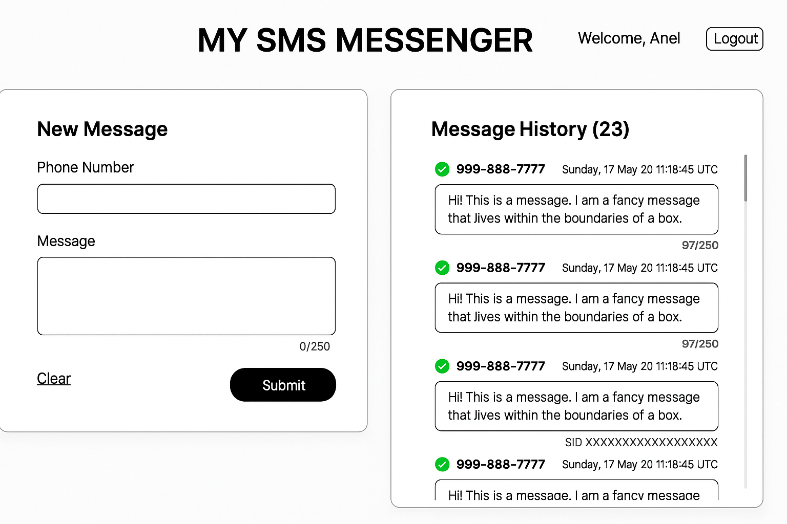

📱 MySMS Messenger Frontend

This is the Angular frontend for the MySMS Messenger app — a modern SMS sending platform connected to a Ruby on Rails API backend with Twilio integration. It allows users to sign up, log in, send SMS messages, and track their delivery statuses live using WebSockets.

🚀 Technologies Used

- Angular 19
- TailwindCSS 3
- RxJS
- @rails/actioncable
- WebSockets (live status updates)

📦 Setup Instructions

Clone the repository:

```bash
git clone https://github.com/yourusername/mysms-messenger-frontend.git
cd mysms-messenger-frontend
```

Install dependencies:

```bash
npm install
```

Run the development server:

```bash
npm run dev
```

The app will be available at [http://localhost:4200](http://localhost:4200).

✨ Features

- **Authentication (JWT-based)**
  - User Sign Up
  - User Sign In
  - Session management with localStorage
- **Message Management**
  - Send SMS messages
  - View message history
- **Live Updates**
  - Real-time delivery status updates via WebSockets
- **Responsive Design**
  - Optimized for mobile and desktop views
- **TailwindCSS Theming**
  - Custom color palette
  - Modern, clean UI
- **Error Handling**
  - Friendly error messages for failed sends and authentication issues

🛠️ Architecture

- **Standalone Components**:
  - `SignInComponent`
  - `SignUpComponent`
  - `MessageFormComponent`
  - `MessageListComponent`
  - `HeaderComponent`
- **Services**:
  - `AuthService` — manages authentication and JWT
  - `MessagesService` — handles sending and fetching messages
  - `CableService` — handles real-time WebSocket communication
- **Interceptors**:
  - `authInterceptor` — attaches JWT tokens to outgoing HTTP requests
- **Guards**:
  - `authGuard` — protects private routes from unauthorized access

🧪 Testing

Run the tests with:

```bash
npm run test
```

**Testing tools**:

- Jasmine
- Karma
- HttpClientTestingModule for API mocks

📸 Wireframe

📸 Wireframe



🔗 Related Repositories

- [`mysms-api`](https://github.com/aneldanza/mysms-api) (Ruby on Rails API)

❤️ Contributing

Pull requests are welcome! For major changes, please open an issue first to discuss the changes you would like to make.
